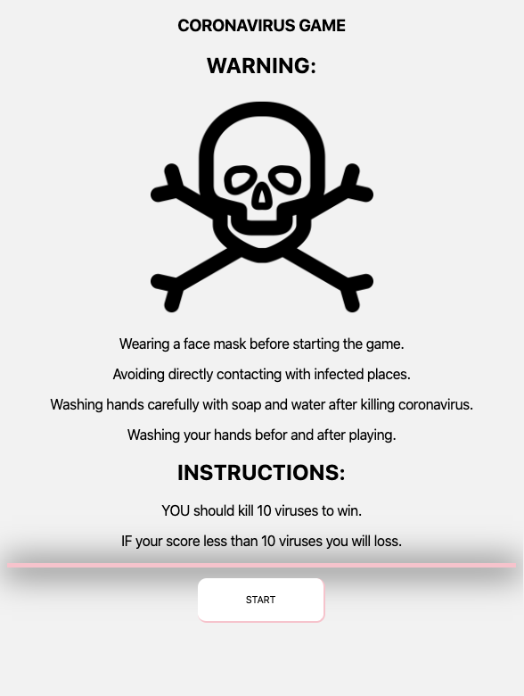
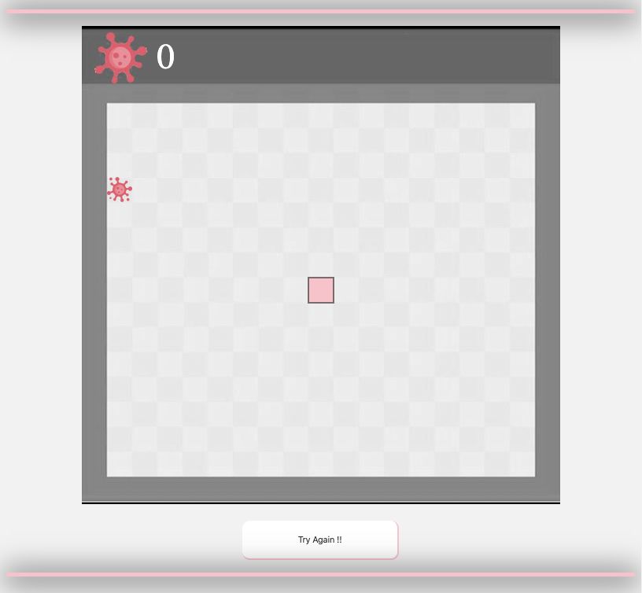
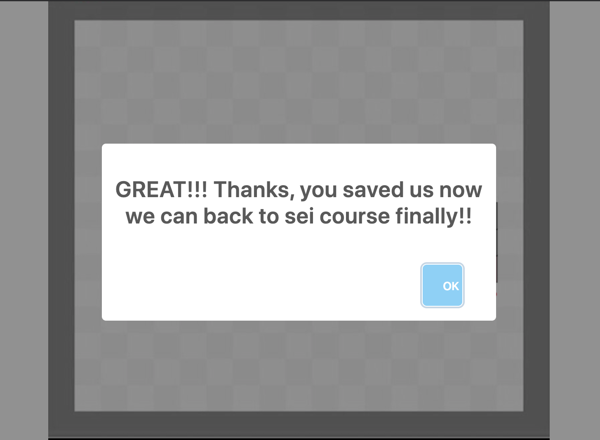
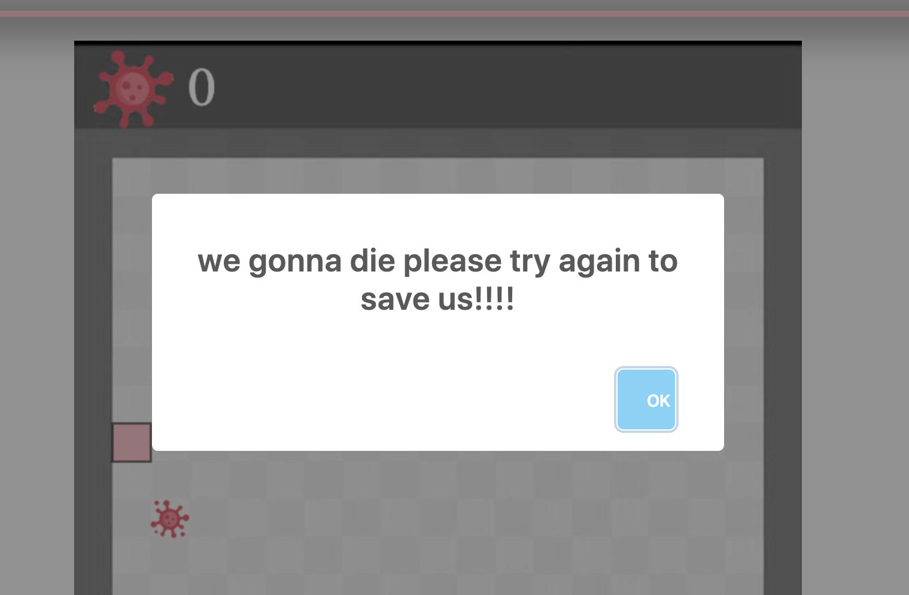

# Project Name
Kill-coronavirus Game
it is a snake game let snake to kill random viruses shown on infected places on screen. the game aim to overcome 
all coronaviruses to let us back to GA and misk classes :(

# frameworks

# start game page:

# game page:

# win alert

# loss alert

# technologies used
-HTML --> canvas technique : it is allow us to draw and animation every elements easily, adding voices and intraction with JS.
- CSS
- JS

# development process Difficulties and problem-solving strategy
- finding free corona virus icons cause it is new :)!
- the hard part in canvas is choose write dimentions and images, boxes size. resizing solved this issues.
- determines correct dimentions to write collesion functions.

# favorite functions
uploading audios and play audio function 

